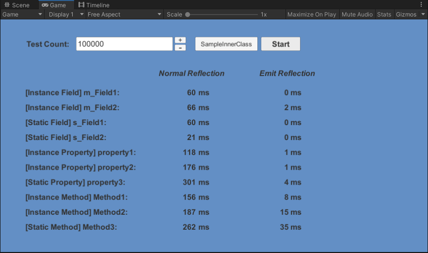

# GraceReflect


## Introduction

This is a C# library which uses Emit to accelerate reflection, implemented at Unity platform. Emit is a feature used to emit Microsoft intermediate language (MSIL) code on the fly at runtime. This library gets a huge performance boost with Emit, which improves performance by up to two orders of magnitude.

## How To Use

Clone this repository, open it with Unity 2019.4.12f1 or newer version. There are 2 folders in root `Assets` folder: `GraceReflect` & `Test`.

All implementation is located at `GraceReflect` folder, meanwhile `Test` is for test code. So you can copy the whole `GraceReflect` folder to whatever project you like.

All interfaces can be found at factory class `GraceReflection`, such as:

``` c#
GraceReflection.CreateFromField(object target, FieldInfo fieldInfo);
GraceReflection.CreateFromProperty(object target, PropertyInfo propertyInfo);
GraceReflection.CreateFromMethod(object target, MethodInfo methodInfo);
```

The first two APIs return a class which implemented interface `IOptimizedAccessor`. They have two methods to read from/write to fields/properties, respectively are `GetValue()` and `SetValue()`. The last one returns a class which implemented interface `IOptimizedInvoker`. It have serval overloaded methods all named `Invoke`.

## Example Code

Suppose there is a class as following. In unity, it's defined in assembly Assembly-CSharp.

```c#
public class SampleOutterClass
{
    private string m_Field1;
    public static void Method1(string arg0, int arg1)
    {
        Debug.Log("This is Method1 of SampleOutterClass");
    }
}
```

Now you can write code like this to get field/method through interfaces of class `GraceReflection`.

``` c#
// Get a type you cannot write it directly.
Type t = Type.GetType("DontLaugh.Test.SampleOutterClass,Assembly-CSharp");
// Create a instance of the type.
object target = Activator.CreateInstance(t);

// Create a accessor.
var accessor = GraceReflection.CreateFromField<string>(target, target.GetField("m_Field1", BindingFlags.Instance | BindingFlags.NonPublic));
// Get/Set value through the accessor.
accessor.GetValue();
accessor.SetValue("New Value");

// Create a invoker of a static method.
var invoker = GraceReflection.CreateFromMethod(null, t.GetMethod("Method1", BindingFlags.Static | BindingFlags.Public));
// Call the method through the invoker.
invoker.Invoke("First parameter", 233);
```

## Performance

If you want to see the exactly performance gap between native reflection and GraceReflect, open test scene named `TestScene` at `Test` folder. Change the test count number to see how huge the performance gap is!


